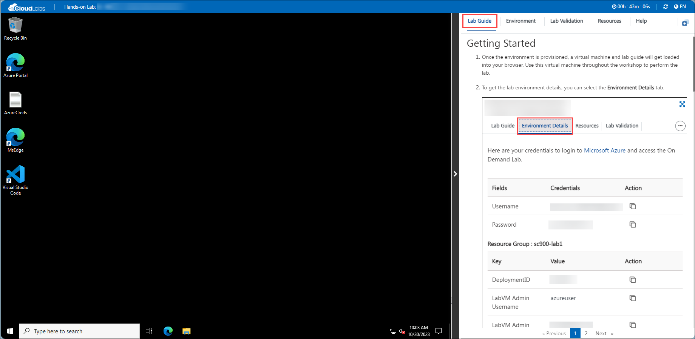

# Getting Started with MIDP Lab With Microsoft Fabric Workshop
 
Welcome to your MIDP Lab With Microsoft Fabric workshop! We've prepared a seamless environment for you to explore and learn about Azure Databricks. Let's begin by making the most of this experience:
 
## Accessing Your Lab Environment
 
Once you're ready to dive in, your virtual machine and lab guide will be right at your fingertips within your web browser.
 

### Virtual Machine & Lab Guide
 
Your virtual machine is your workhorse throughout the workshop. The lab guide is your roadmap to success.
 
## Exploring Your Lab Resources
 
To get a better understanding of your lab resources and credentials, navigate to the **Environment Details** tab.
 

 
## Utilizing the Split Window Feature
 
For convenience, you can open the lab guide in a separate window by selecting the **Split Window** button from the Top right corner.
 

 
## Managing Your Virtual Machine
 
Feel free to start, stop, or restart your virtual machine as needed from the **Resources** tab. Your experience is in your hands!
 

 
## Let's Get Started with Azure Portal
 
1. On your virtual machine, click on the Azure Portal icon as shown below:
 
.png)

 
2. You'll see the **Sign into Microsoft Azure** tab. Here, enter your credentials:
 
   - **Email/Username:** <inject key="AzureAdUserEmail"></inject>
 

 
3. Next, provide your password:
 
   - **Password:** <inject key="AzureAdUserPassword"></inject>
 

 
4. If prompted to stay signed in, you can click "No."
 
5. If a **Welcome to Microsoft Azure** pop-up window appears, simply click "Maybe Later" to skip the tour.
 
6. Click "Next" from the bottom right corner to embark on your Lab journey!
 
.png)
 

## Known Issues

1. If you run into an issue where a file starts downloading( eg. file.html) in the VM or get stuck in between, refresh your browser and continue performing the lab:

2. If you come across the message: **RDP Gateway is in Running state. Please refresh after 1 or 2 minutes**. Please wait for 2 minutes and then navigate to **Resources Tab**, and click on the **Refresh button**:

----

**Note:** If you are not using the environment, pause the VM by navigating to the **Resources Tab** and de-allocate it.

   
**Note:** If you are unable to proceed with the lab execution, here are the links of click-by-click version of the lab to continue.   

[click-by-click without story](https://content.cloudguides.com/guides/Analytics%20in%20MIDP%20-%20Interactive%20Experience)

[click-by-click with story](https://content.cloudguides.com/guides/Analytics%20in%20MIDP%20-%20Interactive%20Experience%20with%20a%20story)

 ----

Now you're all set to explore the powerful world of technology. Feel free to reach out if you have any questions along the way. Enjoy your workshop!
